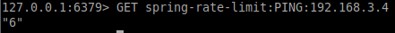

<div style="position: absolute; top: 0px; right: 0px;">
    
</div>

<div style="height: 150px"></div>


# Spring(java) Redis rate-limiting Example
Show how the redis works with Spring(java).

# Redis rate-limiting example (front)


# Redis rate-limiting example (command line)


## Development

```
git clone https://github.com/deliveryweb/redis-rate-limiting-java.git
```

### Run docker compose or install redis manually
Install docker (on mac: https://docs.docker.com/docker-for-mac/install/)
```sh
docker network create global
docker-compose up -d --build
```

#### If you install redis manually open src/main/resources/ folder and provide the values for environment variables in application.properties
    spring.redis.database=
    spring.redis.host=
    spring.redis.port=
    spring.redis.password=
    spring.redis.timeout=


#### Setup and run 

Install gradle (on mac: https://gradle.org/install/)


Install JDK (on mac: https://docs.oracle.com/javase/10/install/installation-jdk-and-jre-macos.htm)
``` sh
gradle wrapper
./gradlew build
./gradlew run
```